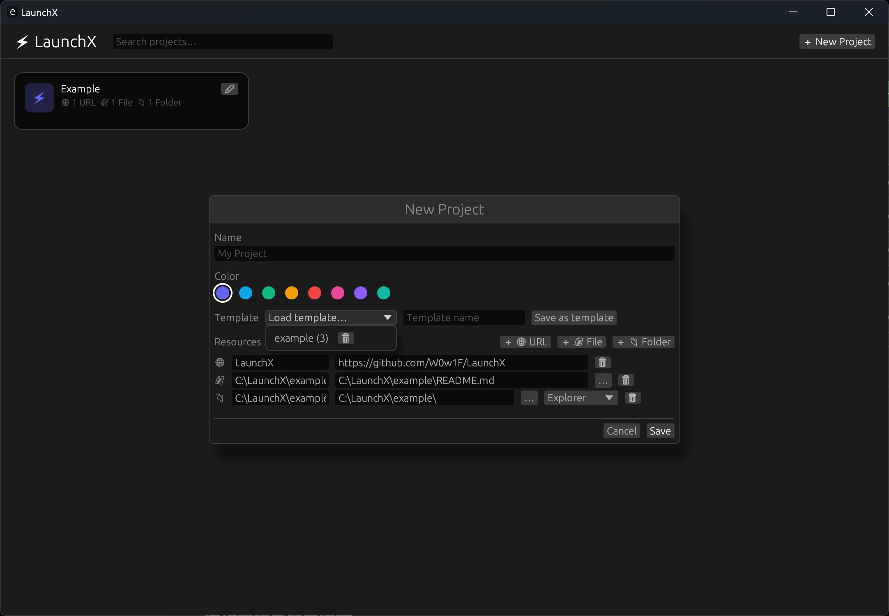

# LaunchX

**把一个项目需要的网页、文件和文件夹放进同一张卡片，双击即可全部打开。**

LaunchX 是一个轻量的项目工作区启动器。你可以为每个项目绑定代码仓库、开发地址、需求文档、源码目录等常用资源，以后开始工作时不再需要逐个查找和打开。



## 主要功能

### 一键打开项目所需资源

LaunchX 支持将三种资源添加到项目中：

| 资源类型 | 打开方式 | 常见用途 |
| --- | --- | --- |
| URL | 使用默认浏览器打开 | 代码仓库、项目主页、本地服务、在线文档 |
| 文件 | 使用系统默认应用打开 | 需求文档、PDF、表格、设计文件 |
| 文件夹 | 使用文件资源管理器或 VS Code 打开 | 源码目录、素材目录、项目工作区 |

双击项目卡片后，所有资源会依次启动。即使某个资源无效或已经被移动，也不会影响其他资源继续打开。

### 集中管理所有项目

每个项目都会显示为独立卡片，并支持：

- 创建、编辑和删除项目
- 设置项目名称和标识颜色
- 添加任意数量的 URL、文件和文件夹
- 查看项目包含的 URL、文件和文件夹数量
- 点击卡片右上角的编辑图标进入编辑
- 双击卡片立即启动整个工作区

### 快速搜索

在顶部搜索框输入内容，即可实时查找项目。

搜索范围包括：

- 项目名称
- 资源名称
- URL 或本地路径

即使项目很多，也能通过仓库名、文件名或目录路径快速定位。

### 资源模板

如果多个项目使用相似的资源组合，可以将当前资源列表保存为模板。

例如可以创建：

- `Web 开发`：本地服务、代码仓库、源码目录
- `产品设计`：需求文档、设计稿、素材目录
- `日常工作`：任务看板、团队文档、工作目录

模板支持：

- 保存当前项目的资源列表
- 将模板加载到新项目或已有项目
- 自动跳过类型和目标相同的重复资源
- 使用相同名称保存时更新已有模板
- 删除不再使用的模板

加载模板不会清空项目中已有的资源，而是将模板内容合并进去。

### 原生文件和文件夹选择

添加本地文件或文件夹时，可以直接点击输入框旁的 `…` 按钮，通过系统原生选择窗口定位资源，无需手动复制完整路径。

### 文件夹可直接用 VS Code 打开

文件夹资源支持两种打开方式：

- **Explorer**：使用系统文件资源管理器打开
- **VS Code**：直接在 Visual Studio Code 中打开该目录

> 使用 VS Code 模式前，请确保 `code` 命令已经加入系统的 `PATH`。

### 清晰的启动结果提示

启动项目后，LaunchX 会在界面右下角显示结果：

- 全部资源打开成功时显示成功通知
- URL 格式无效时显示具体地址
- 文件不存在时显示对应文件路径
- 文件夹不存在时显示对应目录路径
- 一个资源失败不会中断其他资源
- 无效资源的警告会显示在右下角，并在 5 秒后淡出

## 快速开始

1. 启动 `launchx.exe`。
2. 点击右上角的 `＋ New Project`。
3. 输入项目名称并选择颜色。
4. 点击 `＋ URL`、`＋ File` 或 `＋ Folder` 添加资源。
5. 为资源填写名称和目标地址；文件及文件夹也可以通过 `…` 按钮选择。
6. 如果添加的是文件夹，选择使用 Explorer 或 VS Code 打开。
7. 点击 `Save` 保存项目。
8. 回到主界面，双击项目卡片即可打开整个工作区。

## 操作说明

| 操作 | 效果 |
| --- | --- |
| 双击项目卡片 | 打开项目中的全部资源 |
| 单击项目卡片 | 无操作 |
| 点击卡片右上角的 `✏` | 编辑项目 |
| 点击 `＋ New Project` | 创建项目 |
| 在搜索框输入内容 | 搜索项目和资源 |
| 点击搜索框旁的 `×` | 清空搜索内容 |
| 点击文件或文件夹旁的 `…` | 选择本地文件或目录 |
| 在编辑窗口按 `Esc` | 放弃编辑并关闭窗口 |

## 配置与数据

LaunchX 会将项目和模板保存到 `launchx.exe` 所在目录的 `config.json`：

```text
LaunchX/
├── launchx.exe
└── config.json
```

这意味着 LaunchX 可以作为便携式应用使用：将 `launchx.exe` 和 `config.json` 一起复制到其他目录，即可保留全部项目和模板。

建议定期备份 `config.json`。请确保 LaunchX 所在目录具有写入权限，否则无法保存项目或模板。

## 系统支持

- Windows
- macOS
- Linux

LaunchX 是使用 Rust 编写的原生桌面应用，无需安装 Node.js、Electron 或浏览器运行环境。

## 从源码构建

需要安装 Rust stable：

```bash
cargo build --release
```

Windows 构建产物：

```text
target/release/launchx.exe
```
